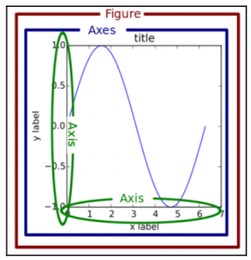

# Programowanie imperatywne

## Prosty problem statystyczny - Rzut monetą

Załóżmy, że rzucając 30 razy monetą w 24 rzutach otrzymujemy reszkę. Czy zagrałbyś taką monetą o swoje życie ? 

**Hipoteza 1** - sprawiedliwa moneta powinna dać ok 15 orłów na 30 rzutów. Moneta jest fałszywa !

**Hipoteza 2** - Przecież wyrzucenie 24 razy reszki na 30 rzutów jest możliwe. To tylko przypadek.


> **Zadanie 1** Jakie jest prawdopodobieństwo wyrzucenia reszki $P(H)$. Jakie jest prawd. $P(HH)$. A $P(THH)$ ? 

Uogólniając możemy napisać: 
$$ P(x) = \frac{n!}{x!(n-x)!}p^x (1-p)^{n-x}$$

> **Zadanie 2** Oblicz prawdopodobieństwo wyrzucenia 24 orłów na 30 rzutów. 

Tak zrobiłby statystyk. 

A jak zrobi analityk ? 


> **Zadanie 3** Wykonaj doświadczenie 100000 razy (oczywiście w pythonie !).


#### Kody, kody, kody

Ze względu, iż potrzebujemy w losowy sposób generować wynik dobrym rozwiązaniem byłoby wygenerować wyniki do listy. Lepszym pomysłem będzie jednak wykorzystanie listy (a raczej tablicy) z biblioteki _numpy_. 

```python
# ładujemy bibliotekę
import numpy as np  


wszystkie_rzuty = 30
liczba_orlow = 24
prawd_sukcesu = 0.5

#0 is reszka 1 is orzeł.

# wygenerujmy jeden eksperyment - jeden rzut monetą

eksperyment = np.random.randint(0,2,wszystkie_rzuty)

print(f"Wynik eksperymentu: {eksperyment}")

# Oblicz liczbę orłów
print ("Orły w eksperymencie:", eksperyment[eksperyment==1]) 
liczba_orlow = eksperyment[eksperyment==1].shape[0]
print ("Liczba orłów w eksperymencie:", liczba_orlow)

```
> **Zadanie 4** jakiego typu jest zmienna `eksperyment` ?


Mając jeden eksperyment chcemy go powtórzyć dowolną ilość razy. Co zaproponujesz ? 

> **Zadanie 5** Napisz funkcję, która pobierze jeden parametr `ilosc_rzutow` i zwróci tablicę gdzie każdy element to ilość orłów w jednym eksperymencie. 


```python

def rzut_moneta_eksperyment(ilosc_rzutow):

    liczba_orlow = np.empty([ilosc_rzutow,1], dtype=int)
    
    for rzut in range(ilosc_rzutow):
        eksperyment = np.random.randint(0,2,wszystkie_rzuty)
        liczba_orlow[rzut] = eksperyment[eksperyment==1].shape[0]
    
    return liczba_orlow

head_count = rzut_moneta_eksperyment(100)   

```


```python
#Liczba gdzie orłów było 24 lub więcej orłów ? .
head_count[head_count>=24]
```

**Uwaga** można pozbyć się pętli w środku.

```python
def coin_toss_experiment_2(ilosc_rzutow):

    head_count = np.empty([ilosc_rzutow,1], dtype=int)
    experiment = np.random.randint(0,2,[ilosc_rzutow,wszystkie_rzuty])
    return experiment.sum(axis=1)
```

## Biblioteka matplotlib

**Przypomnienie** jeśli nie masz pakietu matplotlib to go zainstaluj.

```bash
pip install matplotlib    
```

### Ładowanie pakietu matplotlib


```python
import matplotlib.pyplot as plt
# dla jupytera
%matplotlib inline
```

Narysujmy pierwszy wykres z wykorzystniem listy.

Biblioteka ta korzysta z dwóch różnych sposobów generowania wykresów:

Pierwszy to podejscie imperatywne a drugie w pełni obiektowe.


```python
# pierwszy wykres
squares = [1,4,9,16,25]
plt.plot(squares)
# uruchom podlgąd
plt.show()
```


```python
x = [-3, 5, 7]
y = [10, 2, 5]
plt.figure(figsize=(15,3))
plt.plot(x, y)
plt.xlim(0, 10) # zasięg oś x 
plt.ylim(-3, 8) # zasięg oś y
plt.xlabel('X Axis') # nazwa osi x
plt.ylabel('Y axis') # nazwa osi y
plt.title('Line Plot') 
plt.suptitle('Figure Title', size=20, y=1.03)
# plt.savefig('test.png') # zapis do pliku
```

    Text(0.5, 1.03, 'Figure Title')


#### Gdzie te obiekty ?

Pakiet matplotlib można zamknąć w następującym obrazku:




Zaimportuj moduł matplotlib

```python
import matplotlib.pyplot as plt
```

Stwórz instancje dwóch obiektów:
```python
fig, ax = plt.subplots(nrows=1, ncols=1)
```

Sprawdź co wychodzi z następujących komend:

```python

type(fig)
type(ax)
fig.get_size_inches()
fig.set_size_inches(14,4)
fig
fig.set_facecolor('.9')
ax.set_facecolor('.7')
# mozna tez tak S
plot_objects = plt.subplots(2,4)

```

Przykład jeszcze raz: 

```python
fig, ax = plt.subplots(figsize=(15,3))
ax.plot(x, y)
ax.set_xlim(0, 10)ax.set_ylim(-3, 8)
ax.set_xlabel('X axis')
ax.set_ylabel('Y axis')
ax.set_title('Line Plot')
fig.suptitle('Figure Title', size=20, y=1.03)
```


# Pierwsza klasa

```python
from random import randint

class Die(object):
	"""Pojedyncza kość do gry"""
	def __init__(self, num_sides = 6):
		"""Kość to zazwyczaj sześcian"""
		self.num_sides = num_sides
	
	def roll(self):
	    """Zwraca wartość 1 do liczby ścianek losowo"""
	    return randint(1,self.num_sides)


# PROGRAM
die = Die()

results = []
for roll_num in range(100):
	result = die.roll()
	results.append(result)

print(result)		    		
```

> **Zadanie** Napisz program realizujący 100 rzutów dwoma kośćmi. Policz częstotliwości wykorzystując metodę `count()`

## Druga klasa - Błądzenie losowe

```python

from random import choice
class RandomWalk(object):
	"""generowanie błądzenia losowego"""
	def __init__(self, num_points=5000):
		self.num_points = num_points
		self.x_values = [0]
		self.y_values = [0]

	def fill_walk(self):
		while len(self.x_values) < self.num_points:
			x_direction = choice([-1,1])
			x_distance = choice([0,1,2,3,4])
			x_step = x_direction*x_distance

			y_direction = choice([-1,1])
			y_distance = choice([0,1,2,3,4])
			y_step = y_direction*y_distance

			if x_step == 0 and y_step == 0:
			    continue

			next_x = self.x_values[-1] + x_step
			next_y = self.y_values[-1] + y_step

			self.x_values.append(next_x)
			self.y_values.append(next_y)
```

Zapisz klasę `RandomWalk` do pliku rand_w.py


#### program 1
```python


import matplotlib.pyplot as plt
from rand_w import RandomWalk

rw = RandomWalk()
rw.fill_walk()

plt.scatter(rw.x_values, rw.y_values, s=15)
plt.show()
```

#### Program 2
```python
rw = RandomWalk()
rw.fill_walk()

point_number = list(range(rw.num_points))
plt.scatter(rw.x_values,rw.y_values, c=point_number, cmap=plt.cm.Blues, edgecolor='none', s=15)
plt.scatter(0,0,c='green', edgecolor='none',s=100)
plt.scatter(rw.x_values[-1],rw.y_values[-1], c='red',edgecolor='none', s=100)
plt.axes().get_xaxis().set_visible(False)
plt.axes().get_yaxis().set_visible(False)
plt.show()
```
#### Program 3

```python
rw = RandomWalk(50000)
rw.fill_walk()

point_number = list(range(rw.num_points))
plt.scatter(rw.x_values,rw.y_values, c=point_number, cmap=plt.cm.Blues, edgecolor='none', s=1)
plt.scatter(0,0,c='green', edgecolor='none',s=100)
plt.scatter(rw.x_values[-1],rw.y_values[-1], c='red',edgecolor='none', s=100)
plt.axes().get_xaxis().set_visible(False)
plt.axes().get_yaxis().set_visible(False)
plt.show()
```
